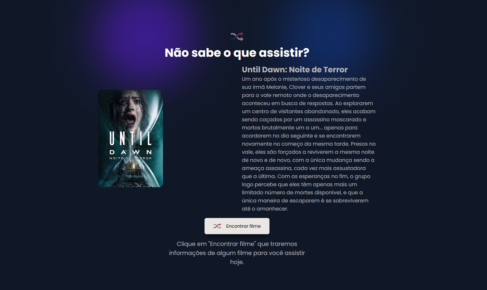

<h1 align="center"> 🎬 Rocketflix </h1>

<p align="justify">

Projeto desenvolvido como parte do desafio **Rocketflix** da trilha Discover da [Rocketseat](https://www.rocketseat.com.br/). O objetivo é criar uma aplicação que exibe informações de filmes aleatórios ao clicar no botão "Encontrar filme", utilizando a API do [The Movie Database (TMDb)](https://www.themoviedb.org/).
</p>

## 📄 Instruções do Desafio

Confira os detalhes completos do desafio [clicando aqui](https://efficient-sloth-d85.notion.site/Desafio-Rocketflix-5ca1c56b5e52473eb12e8b2bc3ab1b8d).


## 🎨 Layout

O layout da aplicação está disponível no [Figma](<https://www.figma.com/design/8a6SH7S0h35qNktNk7MeVc/Rocketflix-%E2%80%A2-Desafio-Discover--Community---Copy-?node-id=0-1&p=f&t=qHMzLNz0NkeHiUvS-0>)


## 📸 Preview do Projeto

<p align="center">
  
  
</p>

## 🧩 Funcionalidades

* Exibir um filme aleatório com título, descrição e pôster ao clicar no botão "Encontrar filme".
* Caso o filme não esteja disponível, exibir uma mensagem de erro personalizada.
* Layout responsivo, adaptando-se a diferentes tamanhos de tela.

## 🛠️ Tecnologias Utilizadas

- [React](https://react.dev/)
- [TypeScript](https://www.typescriptlang.org/)
- [Vite](https://vitejs.dev/)
- [Tailwind CSS](https://tailwindcss.com/) v4
- [Lucide React](https://lucide.dev/)


## 🚀 Como executar o projeto

### Pré-requisitos

<p align="justify">Antes de começar, você vai precisar ter instalado em sua máquina as seguintes ferramentas:</p>

<a href="https://skillicons.dev">
  
</a>


### Obtenha uma chave de API gratuita em [TMDb](https://www.themoviedb.org/settings/api)

```bash
# Crie uma conta no TMDb e gere uma chave de API
VITE_API_KEY = 'api_key=CHAVE_DA_API';
VITE_API_URL = 'https://api.themoviedb.org/3/movie/';
VITE_IMG_URL = 'https://image.tmdb.org/t/p/w500';
```	

### Clone o repositório

```bash
# Clone este repositório
$ git clone <https://github.com/Gelzieny/rocketflix.git>

# Acesse a pasta do projeto no terminal/cmd
$ cd rocketflix

# Instale as dependências
$ npm install

# Execute a aplicação em modo de desenvolvimento
$ npm run dev

# O servidor inciará na porta:3334 - acesse <http://localhost:5173>
```

# 🧑🏻‍💻 Autor

Feito com ❤️ por Gelzieny R. Martins 👋🏽 [Entre em contato!](https://www.linkedin.com/in/gelzieny-r-martins-180551106/)

## 📝 Licença

Este projeto esta sobe a licença [MIT](./LICENSE).
